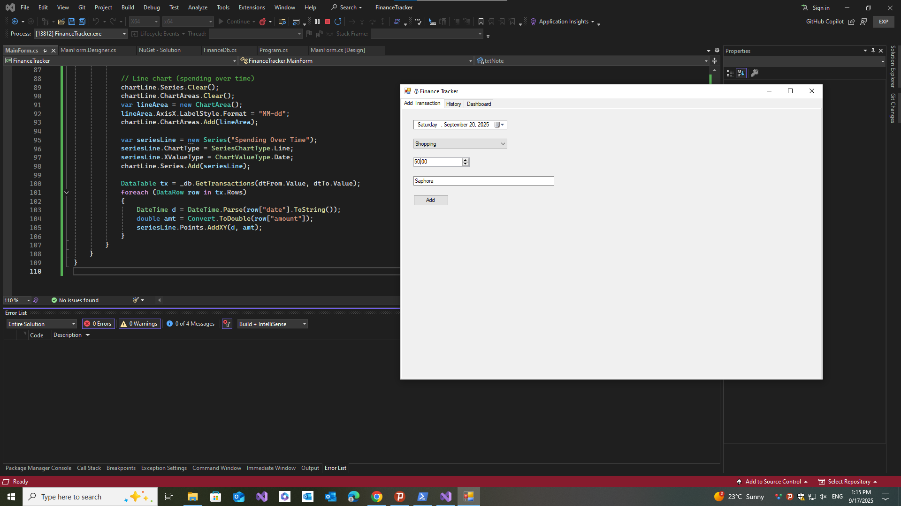
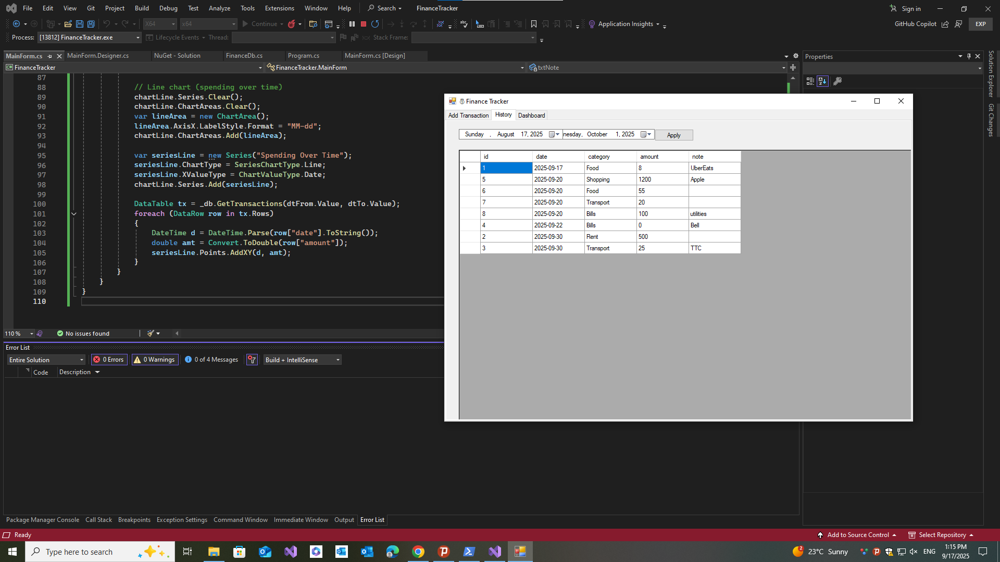
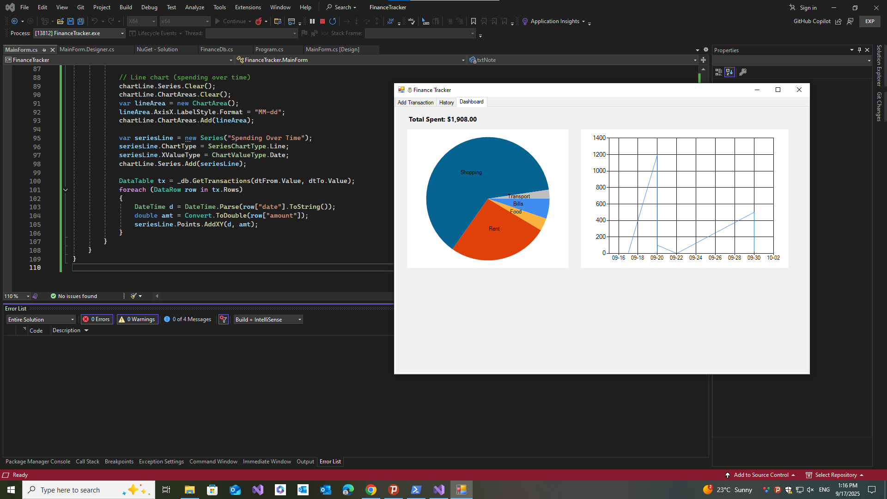

#  💰 Finance Tracker 

A **C# WinForms desktop application** to track personla expenses, view history, and analyze spending trends with charts. 

Built with **.NET Framework 4.7.2**, **SQLite**, and **DataVisualization Charts**.

---
## ✨ Features

- **Add Transactions**
        -Filter transations by date range.
        - Display in a data grid.
      
- **Dashboard Anlaytics**
  -**Pie Chart**: Spending by category.
  -**Line Chart**: Spending over time.
  -**Summary**: Total spending.

-**Local Storage**
  uses SQLite database stored in the user's `%AppData%\FinanceTracker` folder. 

  ---

## 🛠️ Technologies Used

- **C# WinForms** (.NET Framework 4.7.2)  
- **SQLite** with [Microsoft.Data.Sqlite](https://www.nuget.org/packages/Microsoft.Data.Sqlite)  
- **SQLitePCLRaw.bundle_e_sqlite3** (embedded SQLite engine)  
- **System.Windows.Forms.DataVisualization** (charts)

---

## 📂 Project Structure

FinanceTracker/

├── Program.cs # App entry point

├── MainForm.cs # UI logic

├── MainForm.Designer.cs # WinForms designer code

├── FinanceDb.cs # SQLite database helper

├── Properties/ # Project settings

└── README.md # Documentation

---

## 📊 Usage 

1. Go to **Add Transaction** tab -> click **Add Transaction**
2. Check the **History** tav -> filter by date range
3. Explore the **Dashboard** tab -> view spending breakdown and total spent

---

## 📷 Screenshots 

### Add Transaction 

### History 

### Dashboard

